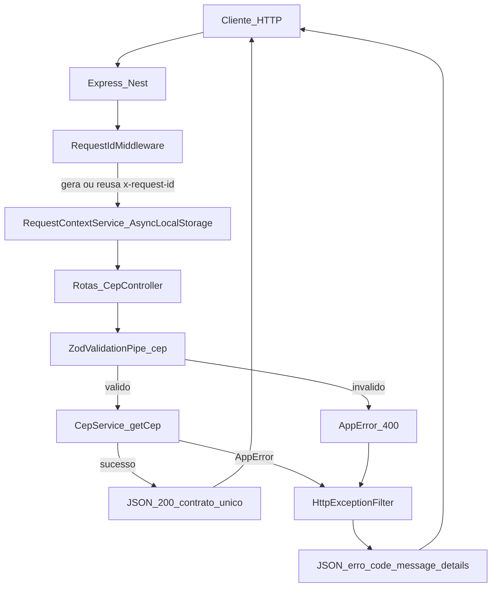
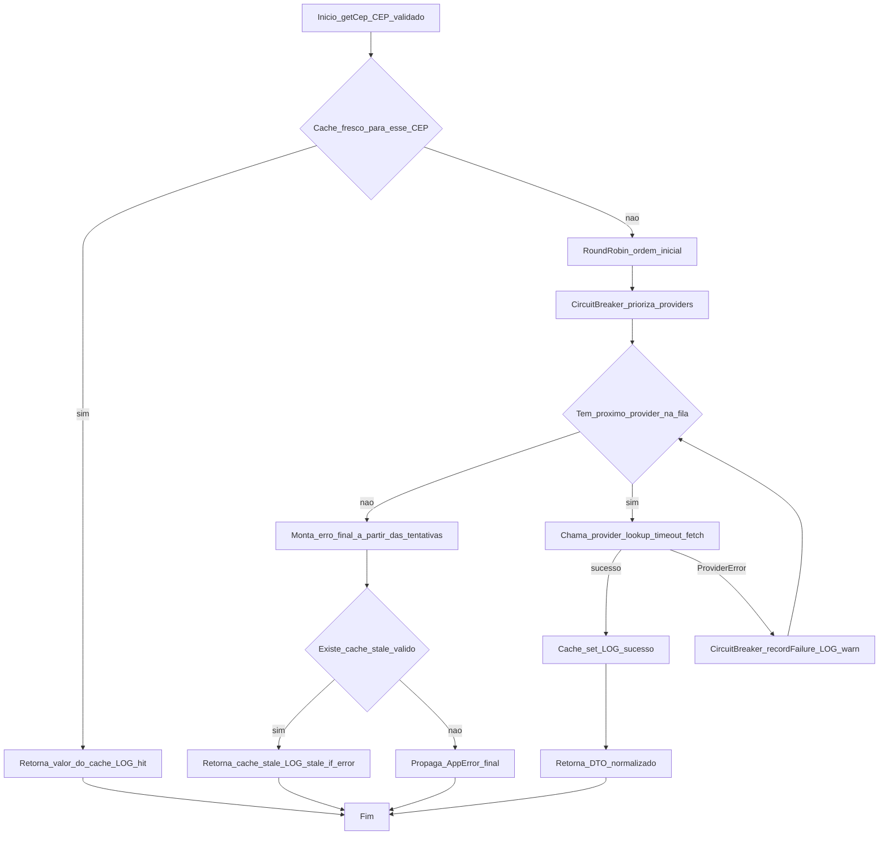

# API de CEP Resiliente

API NestJS/TypeScript para consulta de CEP com dois providers externos, alternancia entre eles, fallback automatico e contrato de resposta unificado.

## Endpoint

`GET /cep/:cep`

Exemplo:

```bash
curl http://localhost:3000/cep/01310-930
```

Resposta:

```json
{
  "cep": "01310930",
  "state": "SP",
  "city": "Sao Paulo",
  "neighborhood": "Bela Vista",
  "street": "Avenida Paulista",
  "provider": "via-cep"
}
```

## Providers suportados

- ViaCEP: `https://viacep.com.br/ws/{cep}/json/`
- BrasilAPI: `https://brasilapi.com.br/api/cep/v1/{cep}`

## Estrategia de resiliencia

- Alternancia entre providers com `round-robin`
- Timeout por provider via `CEP_PROVIDER_TIMEOUT_MS` (default: `2000`)
- tratamento explicito de **HTTP 429** dos providers como categoria `rate_limited`, com `Retry-After` nos detalhes quando existir
- Cache em memoria com TTL para reduzir latencia e dependencia externa
- `stale-if-error`: quando os providers falham, a API ainda pode servir um valor recente de cache
- Circuit breaker simples por provider para evitar insistir em um upstream doente
- Contrato unico de resposta, independente da API externa que respondeu
- Request ID por requisicao para correlacionar logs fim a fim
- Logs estruturados para inicio da consulta, tentativas, fallback, sucesso e falha final

## Regras de erro

- `400`: CEP invalido
- `404`: CEP nao encontrado em todos os providers
- `503`: indisponibilidade dos providers, falhas mistas, ou **rate limit em todos** (`CEP_PROVIDERS_RATE_LIMITED`)
- `504`: timeout em todas as tentativas

Formato de erro:

```json
{
  "code": "CEP_PROVIDERS_UNAVAILABLE",
  "message": "All CEP providers are temporarily unavailable",
  "details": {
    "cep": "01310930"
  }
}
```

## Arquitetura

O fluxo principal segue a separacao:

`Controller -> Validation -> Service -> ProviderStrategy -> Provider -> Mapper`

Arquivos mais importantes:

- `src/modules/cep/cep.controller.ts`
- `src/modules/cep/cep.service.ts`
- `src/modules/cep/strategy/provider-rotator.service.ts`
- `src/modules/cep/providers/via-cep.provider.ts`
- `src/modules/cep/providers/brasil-api.provider.ts`
- `src/modules/cep/mappers/cep.mapper.ts`
- `src/common/filters/http-exception.filter.ts`

## Fluxos (Mermaid)

### Da requisicao HTTP ate a resposta



### Nucleo da consulta no `CepService`



## Documentacao

A API expoe a especificacao OpenAPI em:

- `GET /openapi.json`

E a interface do Scalar em:

- `GET /internal/docs`
- `GET /v1/docs`

## Observabilidade

- Header `x-request-id` gerado automaticamente ou reaproveitado quando enviado pelo client
- Logs com `requestId`, provider tentado, fallback, latencia e classificacao da falha
- Cache hit, cache stale e refresh do cache registrados em log
- Estado do circuit breaker refletido em logs de tentativa

## Como rodar

```bash
npm install
npm run start:dev
```

## Rodando com Docker

```bash
docker compose up --build
```

Com a stack subida:

- API: `http://localhost:3000`
- OpenAPI: `http://localhost:3000/openapi.json`
- Scalar docs: `http://localhost:3000/internal/docs`

Variaveis opcionais:

- `PORT`: porta HTTP da aplicacao
- `LOG_LEVEL`: nivel do logger Pino
- `CEP_PROVIDER_TIMEOUT_MS`: timeout por tentativa de provider
- `CEP_CACHE_TTL_MS`: janela em que o cache e considerado fresco
- `CEP_CACHE_STALE_TTL_MS`: janela adicional em que o cache pode ser usado como `stale-if-error`
- `CEP_CIRCUIT_BREAKER_FAILURE_THRESHOLD`: numero de falhas consecutivas para abrir o circuito
- `CEP_CIRCUIT_BREAKER_RESET_TIMEOUT_MS`: tempo de espera para testar novamente um provider aberto

## Testes

```bash
npm test
npm run build
```

A suite cobre:

- rotacao de providers
- cache fresh e stale
- abertura e recuperacao do circuit breaker
- sucesso direto e fallback
- CEP inexistente
- indisponibilidade total
- timeout total
- validacao HTTP do endpoint
- propagacao do `x-request-id`